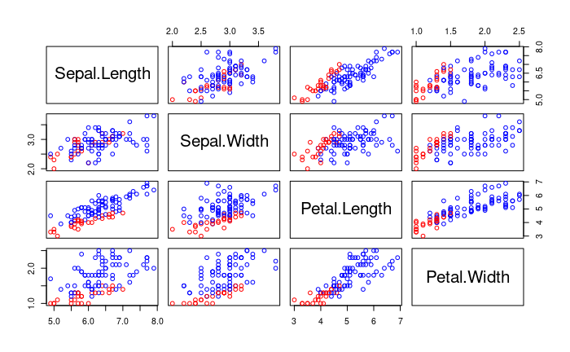

```{r setup, include=FALSE}
knitr::opts_chunk$set(echo = TRUE)
library(dplyr)
library(mvtnorm)
```


# Problem 3
## (c)
```{r}
# data preparation
new.iris <- iris %>% filter(Species %in% c('Versicolor', 'Virginica'))
species <- as.factor(as.vector(new.iris[,5]))
new.iris <- new.iris[,-5]

# simple estimators for parameters
mu1 <- colMeans(new.iris[species == 'Versicolor',])
mu2 <- colMeans(new.iris[species == 'Virginica',])
S1 <- cov(new.iris[species == 'Versicolor',])
S2 <- cov(new.iris[species == 'Virginica',])
pi1 <- (species == 'Versicolor') / length(species) 
pi2 <- 1 - pi1 

# classification
pi1_X <- pi1 * dmvnorm(new.iris, mean = mu1, sigma = S1) # P(X, Label = Versicolor)
pi2_X <- pi2 * dmvnorm(new.iris, mean = mu2, sigma = S2) # P(X, Label = Virginica)
bayes <- pi1_X / pi2_X > pi2 / (10 * pi1)
original_bayes <- pi1_X / pi2_X > pi2 / pi1

predicted <- ifelse(bayes, 'Versicolor', 'Virginica')
table(species, predicted)

original_predicted <- ifelse(original_bayes, 'Versicolor', 'Virginica')
table(species, original_predicted)
```

주어진 loss table을 이용하면, True Versicolor일 때 predicted Verginica의 loss가 10이다. 1을 줬을 때 보다 True Versicolor, predicted Verginica의 수가 줄어듬을 알 수 있다.

```{r}
# pairs(new.iris, col = ifelse(predicted == 'Versicolor', 'red', 'blue'))
```

