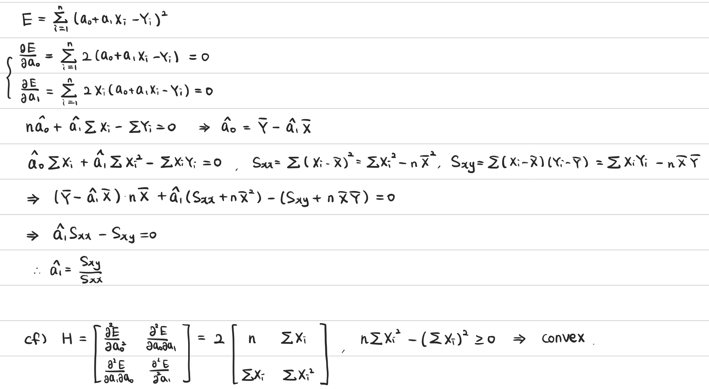
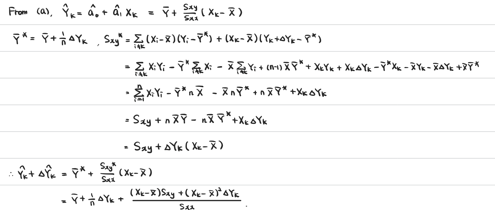
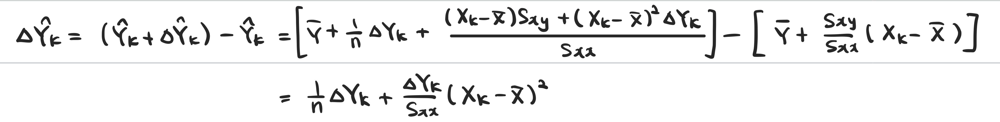
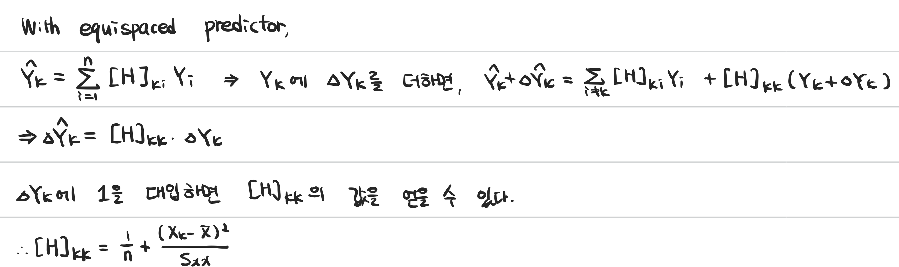

```{r setup, include=FALSE}
knitr::opts_chunk$set(echo = TRUE, comment = NA)
```

```{r libraries, message=FALSE, warning=FALSE, include=FALSE}
library(splines)
set.seed(0)
```
# 1. Reflection boundary condition

### (a) R function for smoothing by a moving average
```{r}
move1 <- function(yy, mm){
  nd <- length(yy)
  yyr <- yy[nd:(nd-mm+1)]
  yyl <- yy[mm:1]
  y <- c(yyl, yy, yyr)
  ey <- c()
  for (ind in 1:nd){
    ey[ind] <- mean(y[ind:(ind+2*mm)])
  }
  ey
}
```

### (b) R function for smoothing by a binomial filter
```{r}
bf1 <- function(yy, mm){
  nd <- length(yy)
  mm2 <- mm * 0.5
  yyw1 <- yy
  yyw2 <- yy
  rlim <- mm2
  yyr <- NULL
  count <- 0
  while(rlim > nd) {
    yyw1 <- rev(yyw1)
    yyr <- c(yyr, yyw1)
    rlim <- rlim - nd
    count <- count + 1
  }
  switch(count %% 2 + 1,
         yyr <- c(yyr, yy[nd:(nd - rlim + 1)]),
         yyr <- c(yyr, yy[1:rlim]))
  llim <- mm2
  yyl <- NULL
  while (llim > nd) {
    yyw2 <- rev(yyw2)
    yyl <- c(yyw2, yyl)
    llim <- llim - nd
  }
  switch(count %% 2 + 1,
         yyl <- c(yy[llim:1], yyl),
         yyl <- c(yy[(nd - llim + 1):nd], yyl))
  y2 <- matrix(c(yyl, yy, yyr), ncol = 1)

  ww <- matrix(0, ncol = nd + mm, nrow = nd + mm)

  imat <- row(ww)
  jmat <- col(ww)

  check <- 0 <= (mm2 + imat - jmat) & (mm2 + imat - jmat) <= mm

  ww[check] <- exp(lgamma(mm +1) -
                     lgamma(mm2 + imat[check] - jmat[check] + 1) -
                     lgamma(mm2 - imat[check] + jmat[check] + 1) -
                     mm * logb(2))

  ey <- ww %*% y2
  ey <- as.vector(ey[(mm2 + 1):(nd + mm2)])
  ey
}
```

### (c) smooth 20 data.
```{r}
yy <- c(2.46, -0.59, 1.14, -0.94, 0.62, -0.63, -0.43, 2.30, 1.29, 0.25, 1.92,
        -0.17, 0.22, -2.13, -3.03, -1.29, -3.24, 1.04, -0.64, 1.85)

xx <- 1:length(yy)

plot(xx, yy, xlab="X", ylab="Y", main="mooving average", type="n")
points(xx, yy, pch =4, lwd = 2, col = "red", cex = 2)

lines(xx, move1(yy, 1), lwd=2)
lines(xx, move1(yy, 3), lwd=2, col="brown")
lines(xx, move1(yy, 5), lwd=2, col="yellow3")
legend("bottomleft", legend=c("m=1", "m=3", "m=5"),
       fill=c("black","brown","yellow3"))

plot(xx, yy, xlab="X", ylab="Y", main="binomial filter", type="n")
points(xx, yy, pch =4, lwd = 2, col = "red", cex = 2)

lines(xx, bf1(yy, 2), lwd=2)
lines(xx, bf1(yy, 4), lwd=2, col="brown")
lines(xx, bf1(yy, 6), lwd=2, col="yellow3")
legend("bottomleft", legend=c("m=2", "m=4", "m=6"),
       fill=c("black","brown","yellow3"))
```

### (d) smooth shifted 20 data.
```{r}
yy <- c(-0.63, -0.43, 2.30, 1.29, 0.25, 1.92, -0.17, 0.22, -2.13, -3.03,
        -1.29, -3.24, 1.04, -0.64, 1.85,2.46, -0.59, 1.14, -0.94, 0.62)

xx <- 1:length(yy)

plot(xx, yy, xlab="X", ylab="Y", main="mooving average", type="n")
points(xx, yy, pch =4, lwd = 2, col = "red", cex = 2)

lines(xx, move1(yy, 1), lwd=2)
lines(xx, move1(yy, 3), lwd=2, col="brown")
lines(xx, move1(yy, 5), lwd=2, col="yellow3")
legend("bottomleft", legend=c(2, 4, 6), col=c("black","brown","yellow3"),
       lty=1, lwd=2, title="m")

plot(xx, yy, xlab="X", ylab="Y", main="binomial filter", type="n")
points(xx, yy, pch =4, lwd = 2, col = "red", cex = 2)

lines(xx, bf1(yy, 2), lwd=2)
lines(xx, bf1(yy, 4), lwd=2, col="brown")
lines(xx, bf1(yy, 6), lwd=2, col="yellow3")
legend("bottomleft", legend=c(2, 4, 6), col=c("black","brown","yellow3"),
       lty=1, lwd=2, title="m")
```

# 2. Fitting a spline by the least squares

### (a) knots
```{r}
spline1 <- function(kk, deg, yy){
  data1 <- data.frame(x=1:length(yy), y=yy)
  fit.lm <- lm(y ~ bs(x, knots=kk, degree=deg), data=data1)
  fitted.values(fit.lm)
}

nd <- 31
xx <- 1:nd
yy <- scan("WAK2.CSV")
knots <- c(10.3, 16.5, 22.8)

ey <- spline1(knots, 1, yy)

par(mfrow = c(1,2))
# fitted graph
plot(xx, ey, type = "n", ylim = c(-15, 5),
      xlab = "X", ylab = "Y", main="Spline")
lines(xx, ey, lwd =4)
points(xx[-3], yy[-3], pch =4, lwd = 2, col = "red", cex = 2)
points(xx[3],yy[3],pch=4,lwd=2,col='blue',cex=2)
# hat matrix
ww <- apply(diag(nd), 2, function(yy) spline1(knots, 1, yy))
persp(1:31, 1:31, ww, xlab = "i", ylab = "j", zlab = "HAT",
      lab = c(3, 3, 3), theta = -30, phi = 20,
      ticktype = "detailed", nticks=3,cex.lab=1,cex.axis=0.6)

# movement of data
yy[3] <- yy[3] - 10

ey <- spline1(knots, 1, yy)

#fitted graph
plot(xx, ey, type = "n", ylim = c(-15, 5),
      xlab = "X", ylab = "Y", main="Spline with movement of data")
lines(xx, ey, lwd =4)
points(xx[-3], yy[-3], pch =4, lwd = 2, col = "red", cex = 2)
points(xx[3],yy[3],pch=4,lwd=2,col='blue',cex=2)
# hat matrix
ww <- apply(diag(nd), 2, function(yy) spline1(knots, 1, yy))
persp(1:31, 1:31, ww, xlab = "i", ylab = "j", zlab = "HAT",
      lab = c(3, 3, 3), theta = -30, phi = 20,
      ticktype = "detailed", nticks=3,cex.lab=1,cex.axis=0.6)
```

# 3. Local linear regression

### (a) R function
```{r}
lline<-function(yy, hh) {
  llin <- function(ex1, xdata, ydata, band) {
    wts <- exp((-0.5 * (ex1 - xdata)^2)/band^2) 
    data1 <- data.frame(x = xdata, y = ydata, www = wts)
    fit.lm <- lm(y ~ x, data = data1, weights = www)
    est <- fit.lm$coef[1] + fit.lm$coef[2] * ex1
    list(est=est, coef=fit.lm$coef)
  }
  nd <- length(yy)
  xx <- seq(from = 1, by = 1, length = nd)
  xxmat <- matrix(xx, ncol = 1)
  
  par(mfrow=c(1,length(hh)))
  for (h in hh){
    eys <- apply(xxmat, 1, llin, xdata = xx, ydata = yy,
              band = h)
    ey <- sapply(eys, function(yy) yy$est)
    ey <- as.vector(ey)
    plot(xx, yy, type = "n", xlab = "X", ylab = "Y",
         main=paste0("local linear regression(h=",h,")"))
    lines(xx, ey, lwd =2)
    points(xx, yy, pch =4, lwd = 2, col = "red", cex = 2)
    for (ind in c(5, 15, 26)){
      xx_sub <- (ind-2):(ind+2)
      yy_sub <- eys[[ind]]$coef[1] + eys[[ind]]$coef[2] * xx_sub
      lines(xx_sub, yy_sub, lwd=4, col="blue")
    }
  }
  ey
}
hh <- c(1.5, 2.5)
ey <- lline(yy, hh)
```


### (b) various bandwidth
```{r}
yy <- c(9.6, 12.8, 14.6, 15.6, 15.5, 15.1, 15.6, 13.8, 13.9, 16.1,
        17.3, 18, 19, 9, 20, 19.9, 18.2, 15.8, 11.2, 9.6, 15.8,
        16.7, 17.5, 13.7, 15.7, 20.6, 21.2, 16.7, 16, 20.7, 17.6)
ey <- lline(yy, hh)
```

# 4. Smoothing spline
### (a) various smoothing parameter
```{r}
smspe<-function(yy, lambda)
{ 
#(1)
  nd <- length(yy)
#(2)
  ss <- c(1, -2, 1, rep(0, nd - 3))
  ss <- rbind(ss, c(-2, 5, -4, 1, rep(0, length = nd - 4)))
  for(ii in 1:(nd - 4)) {
    ss <- rbind(ss, c(rep(0, ii - 1), 1, -4, 6, -4, 1,
                      rep(0, nd - ii - 4)))
  }
  ss <- rbind(ss, c(rep(0, length = nd - 4), 1, -4, 5, -2))
  ss <- rbind(ss, c(rep(0, length = nd - 3), 1, -2, 1))
#(3)
  ssi <- diag(nd) + lambda * ss
#(4)
  ey <- solve(ssi, yy)
  ey <- as.vector(ey)
#(5)
  return(ey)
}
plot(xx, yy, type = "n",xlab = "X", ylab = "Y", main="smoothing spline")
for (lambda in 10^(-1:1)){
  ey <- smspe(yy, lambda)
  lines(xx, ey, lwd = 4, col=log10(lambda)+4)
}
points(xx, yy, pch =4, lwd = 2, col = "red", cex = 2)
legend("topleft", legend=c(0.1, 1, 10), col=3:5, lty=1, lwd=4, title="lambda")
```

### (b) movement of data
```{r}
# movement of data
yy[19] <- yy[19] + 10
yy[20] <- yy[20] + 10
plot(xx, yy, type = "n",xlab = "X", ylab = "Y", main="smoothing spline")
for (lambda in 10^(-1:1)){
  ey <- smspe(yy, lambda)
  lines(xx, ey, lwd = 4, col=log10(lambda)+4)
}
points(xx, yy, pch =4, lwd = 2, col = "red", cex = 2)
legend("topleft", legend=c(0.1, 1, 10), col=3:5, lty=1, lwd=4, title="lambda")

# hat matrix
par(mfrow=c(1,3),mai = c(0,0.2,1,0.2), oma = c(0,0,0,0))
for (lambda in 10^(-1:1)){
  ww <- apply(diag(nd), 2, smspe, lambda=lambda)
  persp(1:31, 1:31, ww, xlab = "i", ylab = "j", zlab = "HAT",
        lab = c(3, 3, 3), theta = -30, phi = 20,
        ticktype = "detailed", nticks=3,cex.lab=1,cex.axis=0.6,
        main=paste0('lambda = ',lambda))
}
```

### (c) hat matrix
```{r}
ss <- matrix(rep(0, length = nd * nd), ncol = nd)
ss[1, 1:3] <- c(1, -2, 1)
ss[2, 1:4] <- c(-2, 5, -4, 1)
for(ii in 3:(nd - 2)) {
  ss[ii, (ii - 2):(ii + 2)] <- c(1, -4, 6, -4, 1)
}
ss[(nd - 1), (nd - 3):nd] <- c(1, -4, 5, -2)
ss[nd, (nd - 2):nd] <- c(1, -2, 1)

par(mfrow=c(1,3),mai = c(0,0.2,1,0.2), oma = c(0,0,0,0))
for (lambda in 10^(-1:1)){
  ww <- solve(diag(nd) + lambda * ss)
  persp(1:31, 1:31, ww, xlab = "i", ylab = "j", zlab = "HAT",
        lab = c(3, 3, 3), theta = -30, phi = 20,
        ticktype = "detailed", nticks=3,cex.lab=1,cex.axis=0.6,
        main=paste0('lambda = ',lambda))
}

```

# 5. Hat matrix of a simple regression

### (a)



### (b)



### (c)



### (d)



### (e)

$\sum_{i=1}^{n}[\mathbf{H}]_{ii} = \sum_{i=1}^n \frac{1}{n} + \frac{(X_k - \bar{X})^2}{S_{xx}} = 2.$